# Pb-Lite Edge Detection and Deep Learning Approaches


## Table of Contents
- [Overview](#overview)
- [Features](#features)
- [Architecture](#architecture)
- [Installation](#installation)
  - [Prerequisites](#prerequisites)
  - [Setup Instructions](#setup-instructions)
- [Usage](#usage)
  - [Pb-Lite Edge Detection](#pb-lite-edge-detection)
  - [Deep Learning Architectures](#deep-learning-architectures)
- [Methodology](#methodology)
  - [Pb-Lite Edge Detection](#pb-lite-edge-detection-methodology)
  - [Deep Learning Approaches](#deep-learning-approaches-methodology)
- [Results](#results)
  - [Pb-Lite Edge Detection Results](#pb-lite-edge-detection-results)
  - [Deep Learning Edge Detection Results](#deep-learning-edge-detection-results)
- [Configuration](#configuration)
  - [Pb-Lite Parameters](#pb-lite-parameters)
  - [Deep Learning Model Parameters](#deep-learning-model-parameters)
- [Troubleshooting](#troubleshooting)
- [Contributing](#contributing)
- [License](#license)
- [Acknowledgements](#acknowledgements)

## Overview

Edge detection is a fundamental task in computer vision, crucial for object detection, recognition, and image segmentation. While traditional edge detection methods like Canny and Sobel have been extensively used, they often struggle with varying image conditions and noise levels. This project explores **Probability-based Edge Detection (Pb-Lite)** alongside multiple **Deep Learning (DL)** architectures—including **DenseNet**, **ResNet**, **ResNeXt**, and a **Custom Network**—to enhance edge detection performance.

The Pb-Lite approach leverages gradient information in texture, brightness, and color to probabilistically determine edge presence, addressing the limitations of conventional methods. Concurrently, deep learning models are employed to learn and predict edges from data-driven features, offering robustness against diverse image scenarios.

## Features

- **Pb-Lite Edge Detection**: Combines gradients from texture, brightness, and color to compute edge probabilities.
- **Deep Learning Models**: Implements and trains DenseNet, ResNet, ResNeXt, and a custom CNN architecture for edge detection.
- **Visualization**: Provides visual comparisons between different edge detection methods.
- **Performance Evaluation**: Assesses the effectiveness of each approach using quantitative metrics.
- **Modular Codebase**: Organized structure for easy navigation and potential extensions.


## Installation

### Prerequisites

- **Operating System**: Windows, macOS, or Linux
- **Python**: Version 3.7 or higher
- **Git**: For cloning the repository

### Setup Instructions

1. **Clone the Repository**

    ```bash
    git clone https://github.com/MayankD409/Pb_lite_Edge_Detection.git
    cd Pb_lite_Edge_Detection
    ```

2. **Create a Virtual Environment (Optional but Recommended)**

    ```bash
    python3 -m venv venv
    source venv/bin/activate  # On Windows: venv\Scripts\activate
    ```

3. **Install Dependencies**

    ```bash
    pip install -r requirements.txt
    ```

    **`requirements.txt`:**

    ```text
    numpy
    opencv-python
    pygame
    matplotlib
    torch
    torchvision
    tqdm
    scikit-learn
    ```

4. **Download and Prepare Data**

    - Place your input images in the `data/images/` directory.
    - Ensure that annotations (if any) are placed in the `data/annotations/` directory.

## Usage

### Pb-Lite Edge Detection

1. **Navigate to the Pb-Lite Directory**

    ```bash
    cd Pb-Lite
    ```

2. **Run Pb-Lite Edge Detection**

    ```bash
    python pblite.py
    ```

    - **Input**: The script will process images from the `data/images/` directory.
    - **Output**: Edge-detected images will be saved in the `results/pb_lite/` directory, and a demonstration GIF will be generated.

### Deep Learning Architectures

1. **Navigate to the _ Directory**

    ```bash
    cd ../DL\ Approach/
    ```

2. **Training Models**

    - **Train a Specific Model**

        ```bash
        python training/train.py --model resnet --epochs 50 --batch_size 16
        ```

        **Parameters:**
        - `--model`: Choose from `densenet`, `resnet`, `resnext`, or `custom_cnn`.
        - `--epochs`: Number of training epochs.
        - `--batch_size`: Size of each training batch.

3. **Inference with Trained Models**

    - **Run Inference**

        ```bash
        python inference/infer.py --model resnet --image_path ../data/images/sample.jpg
        ```

        **Parameters:**
        - `--model`: Model to use for inference.
        - `--image_path`: Path to the input image.

    - **Output**: Edge-detected images will be saved in the respective `results/dl_approaches/` subdirectories, and demonstration GIFs will be generated.

## Methodology

### Pb-Lite Edge Detection Methodology

Edge detection in images involves identifying points where the image brightness changes sharply. Traditional methods like Canny and Sobel rely on gradient computations but often falter in complex environments with varying textures and colors. Pb-Lite enhances edge detection by:

1. **Filter Banks**: Applying a combination of filters (e.g., Derivative of Gaussian, Leung-Malik, Gabor) to capture texture, brightness, and color gradients.
2. **Map Generation**: Creating texton, brightness, and color maps using K-Means clustering to summarize feature distributions.
3. **Gradient Computation**: Calculating gradients for each map to highlight potential edges.
4. **Probability Mapping**: Combining gradient information with traditional edge detectors using probabilistic methods to assign edge probabilities.
5. **Edge Extraction**: Generating the final edge map by thresholding based on computed probabilities.

### Deep Learning Approaches Methodology

Deep learning models have revolutionized edge detection by learning complex feature representations from data. This project explores several architectures:

1. **DenseNet**: Utilizes dense connections between layers to promote feature reuse and alleviate the vanishing gradient problem.
2. **ResNet**: Implements residual connections to enable training of deeper networks by mitigating degradation.
3. **ResNeXt**: Extends ResNet with a split-transform-merge strategy, allowing for scalable and efficient network design.
4. **Custom CNN**: Designs a bespoke convolutional neural network tailored to the specific nuances of edge detection tasks.

**Training Process:**

- **Dataset Preparation**: Images and corresponding edge annotations are prepared and split into training and validation sets.
- **Augmentation**: Data augmentation techniques (e.g., rotation, scaling) are applied to enhance model robustness.
- **Optimization**: Models are trained using loss functions appropriate for edge detection, such as Binary Cross-Entropy or Dice Loss.
- **Evaluation**: Performance is assessed using metrics like Precision, Recall, F1-Score, and Intersection over Union (IoU).

## Results

### Pb-Lite Edge Detection Results

| 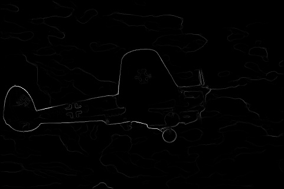 | 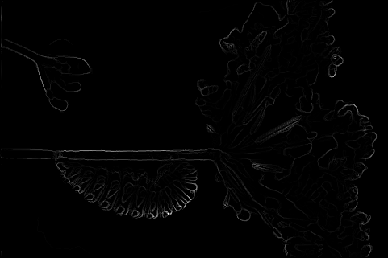 | 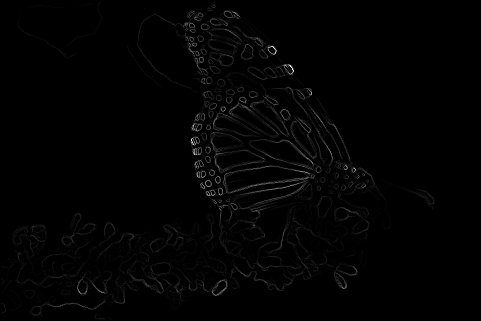 | 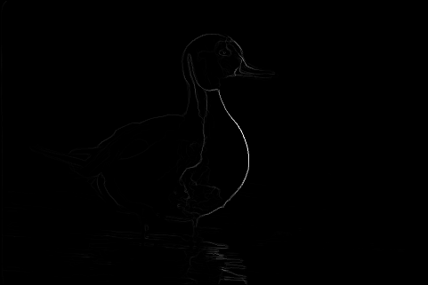 | 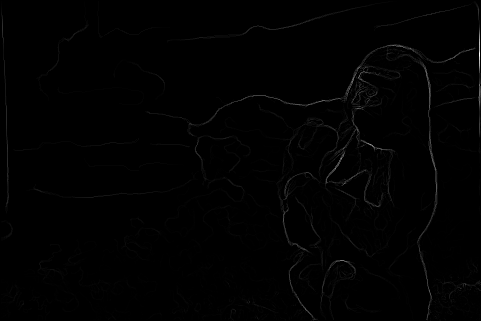 |
|:-----------------------------------------------------------------:|:-----------------------------------------------------------------:|:-----------------------------------------------------------------:|:-----------------------------------------------------------------:|:-----------------------------------------------------------------:|
| 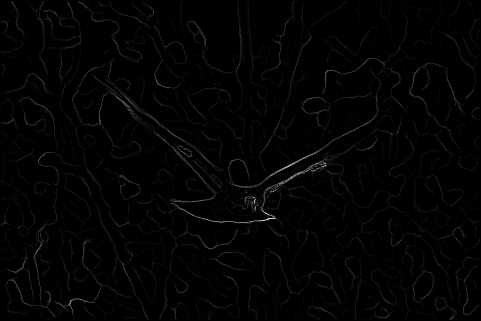 | 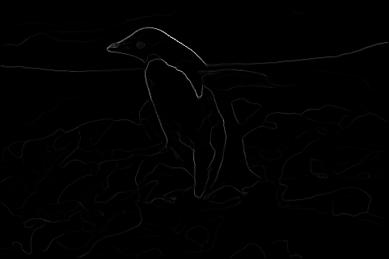 | 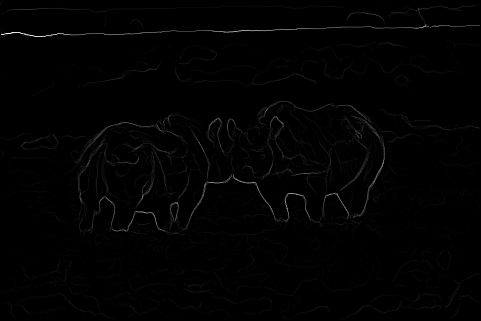 | 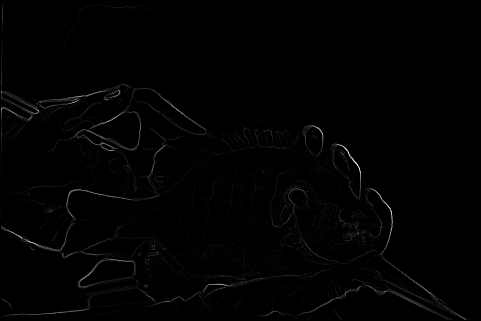 | 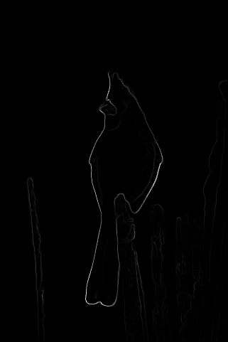 |

- **Description**: Demonstrates the Pb-Lite edge detection process, highlighting how probability-based methods improve edge accuracy over traditional techniques.

### Deep Learning Edge Detection Results

#### DenseNet

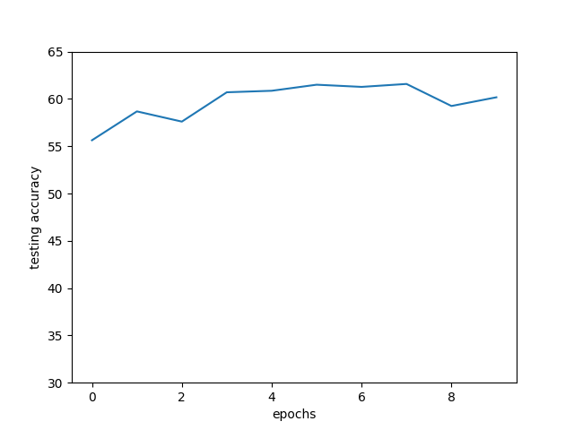

- **Description**: Shows how DenseNet captures intricate edge details through its dense connectivity.

#### ResNet

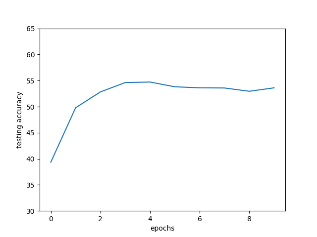

- **Description**: Illustrates ResNet's ability to maintain performance in deeper network configurations.

#### Custom Network

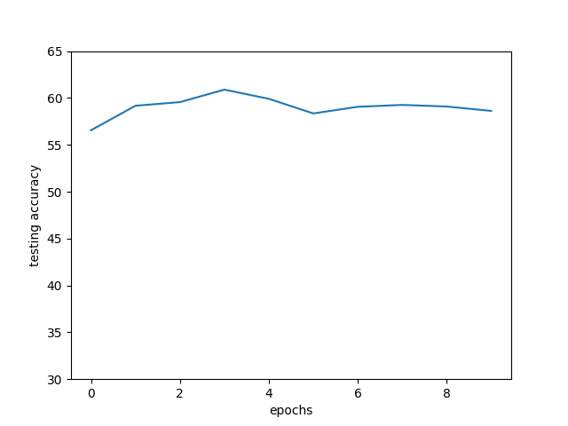

- **Description**: Highlights the tailored architecture's proficiency in capturing essential edge features.

## Configuration

### Pb-Lite Parameters

Parameters can be adjusted within the `Pb-Lite/pblite.py` and `Pb-Lite/utils.py` files to fine-tune edge detection performance.

- **Filter Parameters**: Sizes, orientations, and scales of the filter banks.
- **Clustering Parameters**: Number of clusters in K-Means for texton, brightness, and color maps.
- **Thresholds**: Probability thresholds for final edge extraction.

### Deep Learning Model Parameters

Parameters for each deep learning model can be modified in their respective training and inference scripts.

- **Learning Rate**: Controls the step size during optimization.
- **Batch Size**: Number of samples processed before updating the model.
- **Epochs**: Number of complete passes through the training dataset.
- **Model-Specific Parameters**: Depth, width, and other architecture-specific settings.

## Troubleshooting

- **Pb-Lite Edge Detection Issues**:
  - **Poor Edge Quality**: Adjust filter parameters or clustering settings.
  - **High Computational Load**: Optimize filter sizes or reduce the number of filters.

- **Deep Learning Model Training Problems**:
  - **Overfitting**: Implement regularization techniques or increase dataset size.
  - **Underfitting**: Enhance model complexity or reduce regularization.
  - **Training Instability**: Fine-tune learning rates or switch optimizers.

- **Visualization Errors**:
  - Ensure that Pygame and OpenCV are correctly installed.
  - Verify that all required directories (`results/`) exist and have appropriate permissions.

- **Video Generation Failures**:
  - Confirm that all frames are correctly saved in the `results/` directories.
  - Check OpenCV codec compatibility (e.g., ensure `mp4v` is supported).

## License

This project is licensed under the [MIT License](LICENSE).

## Acknowledgements

- **OpenCV Community**: For providing comprehensive computer vision libraries.
- **PyTorch Developers**: For the powerful deep learning frameworks.
- **Pygame Contributors**: For enabling effective visualization tools.
- **Academic Resources**: For foundational knowledge on edge detection and deep learning.
- **All Contributors**: Who have supported and improved this project.

---
*Enhancing Edge Detection with Pb-Lite and Deep Learning!*
